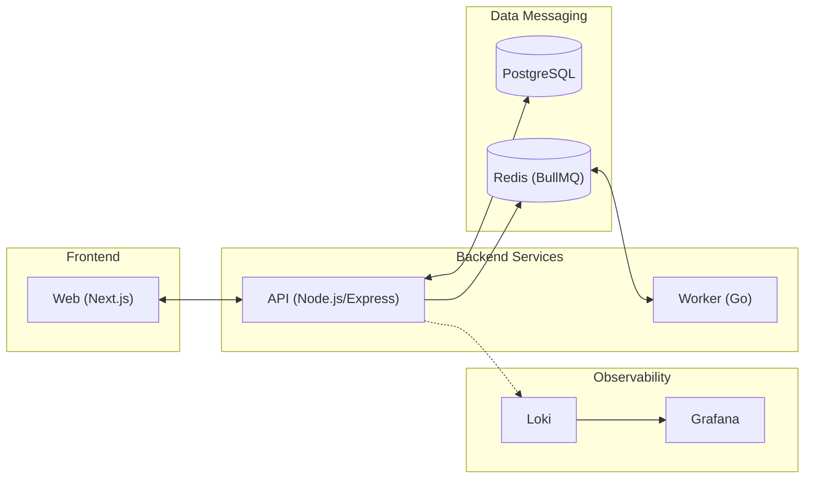

# GameCatalog Monorepo

[](https://github.com/jose-guilherme93/gamecatalog)
[](https://github.com/jose-guilherme93/gamecatalog)
[](https://www.typescriptlang.org/)
[](https://www.postgresql.org/)
[](https://redis.io/)
[](https://go.dev/)

Bem-vindo ao **GameCatalog**, uma plataforma para gerenciamento de avaliações de games. Registre seu perfil, notas, pensamentos e outras informações sobre qualquer game que jogou ou quer jogar.

---

## Arquitetura do Projeto

Este é um monorepo gerenciado por **pnpm workspaces**, composto por três serviços principais:



### Componentes (apps/)

*   **[Frontend (Next.js)](./apps/web)**: http://localhost:3002
    *   Next.js 14 (App Router), React 18, Tailwind CSS.
*   **[API (Node.js)](./apps/api-node)**: http://localhost:3000
    *   Express 5, TypeScript, PostgreSQL, Zod, Vitest.
*   **[Payment Worker (Go)](./apps/worker-donations)**:
    *   Go (Golang), Processamento assíncrono via Redis.

---

## Stack Tecnológica

| Componente | Tecnologias Principais |
| :--- | :--- |
| **Infraestrutura** | Docker, Docker Compose, PostgreSQL (15), Redis |
| **Segurança** | **Infisical** (Secrets Management), JWT, Helmet |
| **Observabilidade** | Grafana, Loki, Winston Structured Logging |
| **Gerenciador** | **PNPM** (Workspaces) |

---

## Guia de Onboarding

### 1. Pré-requisitos

*   **Node.js 18+** & **PNPM 10+**
*   **Go 1.21+**
*   **Docker & Docker Compose**
*   **Infisical CLI** (Obrigatório para variáveis de ambiente)

### 2. Configurações de Segredos (Infisical)

O projeto utiliza o **Infisical** para injetar variáveis de ambiente sem a necessidade de arquivos .env locais.

1.  [Instale o Infisical CLI](https://infisical.com/docs/cli/usage).
2.  Autentique-se:
    ```bash
    infisical login
    ```
3.  Inicie o workspace (caso necessário):
    ```bash
    infisical init
    ```

### 3. Infraestrutura Local

Suba o banco de dados e o cache via Docker:

```bash
docker compose -f docker-compose.dev.yml up -d
```

> [!TIP]
> Para rodar o stack de monitoramento (Grafana + Loki), utilize:
> docker compose -f grafana-compose.yml up -d

### 4. Instalação e Preparação

Instale as dependências e execute as migrações do banco:

```bash
pnpm install
pnpm api:migrate:dev
```

---

## Desenvolvimento

### Rodando Tudo Simultaneamente
```bash
pnpm dev
```

### Comandos Individuais (Root)
| Comando | Descrição |
| :--- | :--- |
| pnpm api:dev | Inicia apenas a API Node.js |
| pnpm web:dev | Inicia apenas o frontend Next.js |
| pnpm worker:dev | Inicia o worker de doações (Go) |
| pnpm test | Executa a suíte de testes da API |
| pnpm build | Gera o build de produção de todos os apps |

---

## Banco de Dados e Migrações

As migrações são gerenciadas manualmente dentro da API Node.js e utilizam infisical para conexão segura.

*   **Criar/Rodar Migrações (Dev):** pnpm api:migrate:dev
*   **Inserir Seed Data:** pnpm --filter @gamecatalog/api insert-data

---

## Observabilidade & Monitoramento

Os logs da API são enviados para o Loki de forma estruturada. 
*   **Grafana:** Acesse em http://localhost:9090 (Configurado via grafana-compose.yml).
*   **User/Pass:** Verifique as variáveis GF_SECURITY_ADMIN_USER no seu Infisical/.env.prod.

---
Desenvolvido por [José Guilherme (Joseti)](https://github.com/jose-guilherme93). MIT License.
